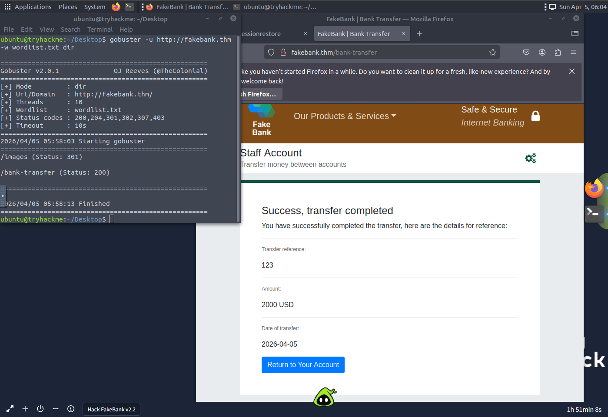

## TryHackMe Learnings

### Pre-Security Learning Path

| Room | Key Takeaways | Screenshot |
|------|----------------|-------------|
| [Offensive Security Intro](https://tryhackme.com/room/offensivesecurityintro) | Offensive Security, Defensive Security, gobuster. |  |
| [OSI Model](https://tryhackme.com/room/oscimodel) | 7 layers, encapsulation, PDU names. |  |

### Complete Beginner Path (In Progress)

- [x] [How Websites Work](https://tryhackme.com/room/howwebsiteswork) – HTTP requests/responses, status codes.  
  

## Projects
- Detection Lab
- SOC Automation Project
