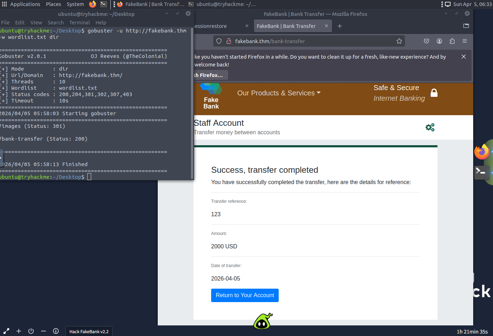

## TryHackMe Learnings

### Pre-Security Learning Path

| Room | Key Takeaways | Screenshot |
|------|----------------|-------------|
| [Offensive Security Intro](https://tryhackme.com/room/offensivesecurityintro) | In this room, I learned the 2 general sides in Cybersecurity, the Offensive and Defensive side. But this room focused more on the offensive side. Which is basically about compromising an existing system. In this room, I was able to hack into a fake bank, which somehow, gave me an idea of what it is like hacking a bank. It is really important to sanitize your company's website, because in this case, I was able to access the webpage meant for admins to access, which allowed me to exploit it. |  |
| [Inside a Computer System](https://tryhackme.com/room/insideacomputer) | 7 layers, encapsulation, PDU names. |  |

### Complete Beginner Path (In Progress)

- [x] [How Websites Work](https://tryhackme.com/room/howwebsiteswork) – HTTP requests/responses, status codes.  
  

## Projects
- Detection Lab
- SOC Automation Project
